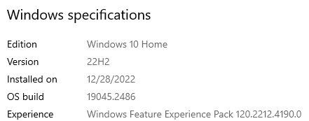
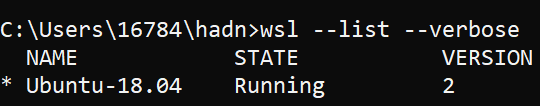
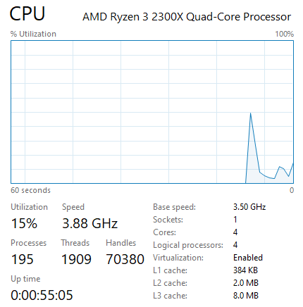

# Podman Guide

## Prerequirement

1.  Check Windows 10 with (build 19,041 or later)

    

1.  Check WSL version - Open cmd window > wsl --list --verbose

    

1.  Check CPU with virtualization enable

    1. Task manager > Performance > CPU -> Virtualization: Enabled
    1. **If at any time you experience the errors 0x80070003 or 0x80370102 (or any error indicating the VM cannot be started), you most likely have virtualization disabled. Check your BIOS (or WSL 2 instance) settings to verify VT-x/AMD-V/WSL 2 instance and SLAT are enabled.**

        

## Installation

1. Download podman from github - <https://github.com/containers/podman/releases/download/v4.4.1/podman-v4.4.1.msi>
1. Executing a downloaded **podman-v4.4.1.msi** for installation.

## Configuration

1. Open cmd window and import VM Image into for podman to run containers - `podman machine init`

## CLI Cheat Sheet

1. **C:/Program%20Files/RedHat/Podman/podman-for-windows.html**

| Command | Description                                                                                                                    |
| ------- | ------------------------------------------------------------------------------------------------------------------------------ |
| init    | Initialize a new WSL 2-based machine instance.                                                                                 |
| start   | Start a WSL 2 machine instance.                                                                                                |
| stop    | Stop a WSL 2 machine instance. If you are not running containers, you might want to stop to save system resources.             |
| list    | List WSL 2 machines.                                                                                                           |
| rm      | Remove a WSL 2 machine instance.                                                                                               |
| set     | Set an updatable WSL machine setting.                                                                                          |
| ssh     | - ssh into a WSL 2 machine instance.                                                                                           |
|         | - This is useful for entering the WSL 2 instance and running the native Podman commands.                                       |
|         | - Some Podman commands are not supported remotely, and you might want to change some configurations inside the WSL 2 instance. |
